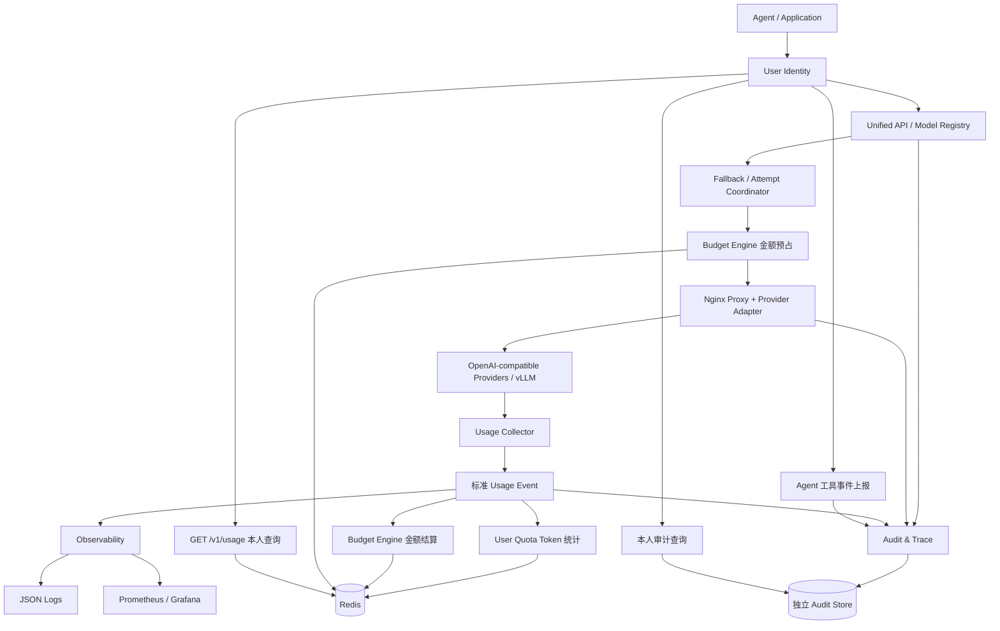

## Context

动机和范围见 [proposal.md](proposal.md)。初始化时仓库只有 `.git/`，没有业务代码、现有规格或 AGENTS.md。已安装 OpenSpec 1.12.0、Node 和 Python；PowerShell 禁止执行 npm 的 `.ps1` shim，应使用 `openspec.cmd`。当前 PATH 未发现 Docker，后续运行测试需要 Docker Engine/Desktop 的 Linux 容器环境或 Linux CI。

下面是待实施设计，不代表已经具备这些运行能力。M0–M4 共用一个变更，按阶段验收；M5 不纳入该变更完成条件。现有会话已提供 OpenSpec 技能，因此初始化采用 `--tools none`，无需复制工作区工具技能或修改用户全局配置。

## Goals / Non-Goals

**Goals:**

- 数据面以 Nginx `proxy_pass` 为核心，Lua 负责身份、策略和有限响应观察。
- 一份 Usage Event 服务三个消费者；金额与 Token 有独立状态、策略和命名空间。
- 尽可能在转发前完成检查；完成后异步幂等结算，无法确认的费用保持可见。
- 采用保守、可测试的主备边界；不以 HTTP 状态码推断生成一定没有消耗。
- 独立 Audit & Trace 模块留存请求/回复内容和工具执行链路，明确区分网关观察、Agent 上报和记录缺口。

**Non-Goals:**

- 不保证 Provider 最终账单与本地按版本价格计算完全相同，不自动处理折扣、税费或汇率。
- 不承诺 timer 队列在 worker 崩溃后精确恢复；MVP 通过调用前记录和保留预占暴露缺口。
- 不将用户 Token 配置限额作为准入条件；不引入全局实时排序或智能路由。

## Decisions

### 1. 模块与执行顺序



| 阶段 | 职责 | 网络 I/O 决策 |
| --- | --- | --- |
| 启动配置生成 / init | 校验配置，加载不可变配置快照、插件及价格 | 不在 init 阶段连接 Redis |
| init_worker | 注册周期恢复和指标刷新 timer | 网络调用在 timer 回调内 |
| access | 身份、请求体校验、路由、开始记录、金额原子预占、审计开始证据 | Redis、DNS、内部 Audit Store 调用在允许的阶段执行 |
| Nginx proxy | HTTP/TLS、连接池、背压、响应转发 | 原生代理 |
| header_filter | 响应状态、类型、请求追踪头 | 不执行 Redis I/O |
| body_filter | 有界 JSON/SSE 观察、usage、首内容时间、审计内容副本 | 不执行网络/同步磁盘 I/O，不延迟转发等待完整流 |
| log | 请求汇总、事件快照、提交异步结算与审计收尾 | `ngx.timer.at` 回调消费 Redis 或独立 Audit Store |

插件按依赖拓扑执行；身份、请求上下文为公共核心，User Quota 与 Budget Engine 依赖 Usage Collector。Audit & Trace 使用身份、请求/响应观察和 Usage Event 关联，但拥有独立启停配置、存储及故障状态，不依赖 metrics 插件，也不改写计量事件。关闭可选插件须通过依赖校验，公开业务路径不能关闭身份认证。MVP 不要求 `balancer_by_lua` 完成动态预算或跨 Provider 参数修改。

### 2. 配置、身份和协议边界

YAML 是操作员编辑入口。构建/启动脚本以安全 YAML 加载器进行类型和引用校验，生成 JSON 快照供 Lua 读取；不在每个请求解析 YAML。配置包括 `gateway.yaml`、`models.yaml`、`users.yaml`、`budgets.yaml`、`audit.yaml`，可以在实现时合并物理文件而保持逻辑边界。

模型记录包含 logical_model、provider、upstream_model、base_url、凭证环境变量引用、capabilities、tier、上下文/输出上限、输入输出费率及 price_version。配置只允许已登记的 HTTP/HTTPS 地址；生产 HTTPS 验证证书并显式设置 SNI/Host。Provider Key 与 Gateway Key 使用不同环境变量，示例只包含测试值。Key 高熵，配置引用或存储摘要；禁止把真实 Key 写入仓库。

Key 映射可信 user_id 与可选 agent_id；同用户多个 Key 用量合并。请求携带的同名字段不参与鉴权和计费，转发前移除网关自定义身份字段。合法 OpenAI `user` 字段可作为普通 Provider 元数据转发，但不能成为本地账本主体。

请求默认上限 1 MiB。输出上限由 max_completion_tokens 或兼容后端的 max_tokens 表达，二者冲突返回 400；未提供时注入模型配置默认值，超过模型上限返回 400。`n` 默认为 1，支持范围由适配器能力和配置上限约束，预算按 n 放大输出预占。工具及 tools/tool_choice 字段保留，不支持的能力明确拒绝。

网关生成错误统一结构：`{"error":{"message":"...","type":"...","code":"..."},"request_id":"..."}`。使用网关生成且不可由客户端覆盖的 request_id，返回 `X-Request-ID`。Provider 已有兼容错误保留状态与安全错误体；无法解析的错误替换为通用说明，不泄露内部地址、凭证或原始 HTML。

### 3. 主备切换：每次尝试重新进入 access

采用两个明确的代理 location（主、备），每个 location 内关闭隐式上游重试 `proxy_next_upstream off`。本地连接类错误进入内部命名错误处理 location，由 Lua 判定是否允许进入备用代理的 access 阶段；`proxy_intercept_errors off` 保持 Provider 自身的 429/5xx 响应走正常过滤和用量采集。上限只支持 1 或 2，避免多个重试层叠乘。

这样可在备用 access 中重写上游模型、凭证、Host、SNI、URI 并重新预占金额。相比只在 balancer 中替换 IP，该方案可以处理不同 Provider 的凭证和模型映射，且不在禁止 yield 的阶段调用 Redis。不会用 `ngx.location.capture` 缓冲完整 SSE，也不改成 Lua HTTP 客户端接管所有转发。

允许切换需同时满足：

1. 当前候选连接失败/连接超时；
2. 本次 `$upstream_bytes_sent` 明确为 0，未收到上游响应，客户端未收到任何响应；
3. 仍有兼容备用、未超过请求总时限及尝试上限；
4. 备用金额预占成功。

计数缺失、解析失败或证据不完整时禁止连接故障重试并标记未知，不把 `-` 当成零。默认读取超时、已发送后错误和 Provider 返回 429/5xx 均不自动重试；用户追加的可选额度耗尽例外见末尾专项设计。SSE 中断直接结束原流，不拼接、不伪造 `[DONE]`。

内部重定向可能清空 `ngx.ctx`，所以不能仅将身份与尝试保存在 `ngx.ctx`。使用网关私有 Nginx 请求变量保存有界、可恢复的上下文快照（原始请求的必要信息、身份、配置版本、尝试列表、价格版本），只有网关代码可写；不从客户端同名头恢复，不把上下文写入日志。读取原始请求体后保留有界副本用于备用请求重建，禁止落入 Redis 或常规日志。备用 location 对首次/再次进入进行状态校验，防止循环。

M2 最先验证这一具体风险：固定 OpenResty 版本中的命名 location、错误变量、POST 请求体保留及不同凭证切换。所有场景在真实 Nginx 中运行，不能仅用模拟 ngx 的单测宣告支持。事实依据见 [Nginx 重试语义](https://nginx.org/en/docs/http/ngx_http_proxy_module.html#proxy_next_upstream)、[上游字节计数](https://nginx.org/en/docs/http/ngx_http_upstream_module.html#var_upstream_bytes_sent)及 [OpenResty 上下文说明](https://github.com/openresty/lua-nginx-module#ngxctx)。

### 4. 共享用量契约

```json
{
  "schema_version": 1,
  "request_id": "req_001",
  "attempt_id": "req_001:1",
  "user_id": "user_001",
  "agent_id": "agent_001",
  "requested_model": "balanced",
  "model": "upstream-model-a",
  "provider": "provider_a",
  "prompt_tokens": 1200,
  "completion_tokens": 500,
  "total_tokens": 1700,
  "usage_source": "provider",
  "usage_status": "known",
  "status": "completed",
  "started_at": "2026-09-23T06:00:00Z",
  "finished_at": "2026-09-23T06:00:01Z",
  "period_day": "2026-09-23",
  "period_month": "2026-09",
  "price_version": "example-v1"
}
```

`status` 为 completed/failed/interrupted，`usage_status` 为 known/unknown/estimated，`usage_source` 为 provider/system/unknown/estimate。MVP 精确计数只接收 known；未知 Token 为 null。输入和输出的明细（cached/reasoning 等）是组成部分，保留详情用于审计，不再次加入 total。基础三项必须是安全非负整数并满足 prompt+completion=total；不满足时标记 unknown 并计异常指标。未来适配器若有不同口径，须显式版本化规范化。

Usage Collector 的 JSON 仅保留有上限的响应观察副本；SSE 增量缓存未完成事件，支持 LF/CRLF、跨 chunk、多行 data 与 UTF-8 分段。建议观察上限为 JSON 4 MiB、单 SSE 事件 256 KiB，均可配置。计量解析超限则标记 unknown，不损坏数据转发。Audit 模块使用同一响应解析器的只读输出另建有界内容副本，不让两套插件分别解释 usage；审计内容达到保存上限后，计量仍继续读取后续 usage。对有效 usage 赋值而非按 chunk 累加，避免累计计数重复。

只对支持的 Provider 注入 `stream_options.include_usage=true`。不支持时不注入，缺少最终统计是 unknown。TTFT 以第一段非空文本、拒绝内容或 tool call 实际参数计算；仅 role、空 delta、usage 和响应头不算首 Token。计量的时刻采用网关单调时间测时，周期归属用 wall clock。

### 5. Redis 数据模型与独立消费者

MVP 使用单机 Redis，持久化卷与 AOF；运行状态不保存在 YAML，也不从 Prometheus 反推账本。金额多维事务不直接支持 Redis Cluster，后续需要重新设计 hash slot/事务边界。

| Key | 类型 | 用途 |
| --- | --- | --- |
| `usage:attempt:<attempt_id>` | Hash | 身份、开始窗口、价格快照、pending/known/unknown、各消费者状态、最终事件摘要 |
| `usage:pending` | Sorted Set | 按恢复到期时间索引未完成尝试 |
| `quota:usage:<user_id>:<YYYY-MM-DD>` | Hash | 日 prompt/completion/total、unknown_attempts、pending_attempts |
| `quota:usage:<user_id>:<YYYY-MM>` | Hash | 同口径月统计 |
| `budget:ledger:<epoch>:global` | Hash | limit、spent、reserved |
| `budget:ledger:<epoch>:agent:<agent_id>` | Hash | 可信 Agent 金额约束 |
| `budget:ledger:<epoch>:model:<logical_model>` | Hash | 逻辑模型金额约束 |
| `budget:reservation:<attempt_id>` | Hash | 各维度、预占金额、price_version、状态、租约、实际金额 |

用户计数仅需 Hash；额外 ZSET 用于恢复索引，避免扫描全部历史 Key。每次尝试发送前先原子创建开始记录并更新 pending；金额预占在独立脚本完成。预占拒绝时以未发送精确零完成这条记录并撤去 pending。真正交给代理之前必须持久化 dispatching 标志；即使金额插件关闭，此标志仍由公共计量组件维护。MVP 用户统计也依赖开始记录，因此 Redis 不可用时拒绝需要记账的调用，不悄悄漏计。

消费分离：Quota 脚本原子更新日/月 Hash 和 `quota_state`，Budget 脚本独立更新金额和 `budget_state`。二者共享事件/attempt_id，但不存在“金额脚本扣 Token”。任一消费者失败不重复执行另一个消费者的已完成效果。查询读取日/月和元数据的单个快照，避免展示半次日/月更新。

同一 attempt_id 的重复 known 事件为 no-op；不同 payload 的冲突重放拒绝并告警。pending→unknown 移动计数而非增加两份，unknown→known 受控补录只增加一次精确 Token，同时减少未知计数。补录还需补齐相应金额状态；失败可重复执行。不同请求不按内容去重，客户端重发是新请求。

统计时区固定 Asia/Shanghai（本版 UTC+08:00），由尝试开始时刻生成 period_day/month，晚结算不跨桶。日记录保留至该日结束后 35 天，月记录保留至该月结束后 400 天，TTL 不因重放延长。自动重放窗口最长 7 天，已结算去重记录至少保留 400 天；过旧自动事件拒绝处理。离线补录仅修正仍在保留期内的窗口，已过期日桶不重建，审计中注明可修正范围；金额历史按记录继续核对。

未解决预占和未知尝试不能自动 TTL 删除。周期扫描、数量/年龄告警及离线核对负责收敛，保留期仅适用于已完成历史；必要时在存储容量达到配置阈值前拒绝新准入，不能通过驱逐未结算 Key 恢复容量。Redis 配置 `noeviction`，脚本在第一次写入前校验 key 类型、数值边界与输入，避免运行时脚本错误造成局部效果。Redis 脚本提供隔离执行，并不意味着可以忽略错误处理。参考 [Redis Lua 脚本文档](https://redis.io/docs/latest/develop/programmability/eval-intro/)。

### 6. 金额准入、价格和恢复

默认单币种 USD，内部单位为 micro-USD（10^-6 USD）。费率使用“每百万 Token 的整数 micro-USD”，示例价格仅为测试数据，非真实供应商报价。金额计算为 `ceil((prompt_tokens * input_rate + completion_tokens * output_rate) / 1000000)`；所有中间乘积和总计必须小于 2^53，校验不通过拒绝配置/事件，避免 Lua 双精度整数失真。

默认预占使用模型声明的最大输入 Token 上界与请求输出上限；`n>1` 按输出份数放大，具体 Provider 若输入也按份收费则适配器声明该规则。按最大上下文预占较保守，但比不具备 tokenizer 校准时用字符数假装精确更可靠。预算记录明确 `reservation_method=context_ceiling`；精确 tokenizer 预估可后续替换。Provider 未遵守其上界或额外计费仍可能产生 overrun，结算如实记录和报警，不能承诺外部账单永不超额。

金额 epoch 是配置指定的稳定预算周期标识，MVP 不自动重置金额账本；改限额或重载配置不清空 spent。全局、绑定 Agent（若有）、逻辑模型同时准入；无 Agent 绑定时不接收客户端 Agent 选择，仍应用全局与模型预算。不同 Provider 的价格按实际尝试快照结算，但约束归属逻辑模型。

状态迁移：

```text
created -> reserved -> settled
                    -> released (能够证明未发送)
                    -> usage_unknown -> reconciled
```

返回响应与记账分离：log 阶段复制不可变事件交给 timer，回调创建自己的 Redis 连接、使用超时与连接池，不能引用已经销毁的请求对象。暂时失败采用有限指数退避；队列满、timer 创建失败、重试耗尽均输出脱敏事件摘要与计数，并保留 Redis 开始记录。网络 I/O 的阶段约束依据 [OpenResty cosocket 文档](https://github.com/openresty/lua-nginx-module#cosockets-not-available-everywhere)。

恢复扫描采用分批领取和短租约，多个 worker 并发执行仍靠脚本状态条件保证幂等。lease 到期不等于费用为零：恢复脚本先原子禁止已超时 created 记录再进入 dispatching，才能把未有 dispatching 标志的尝试按未发送处理；有 dispatching 标志但最终事件丢失则标记未知、保留金额。不能在关闭金额插件时仅因不存在 reservation 就判定未发送。待核对工具是操作员离线命令，输入 attempt_id、核对依据、精确用量或证实未发送的结果，输出变更预览和审计；不是管理员 HTTP 查询接口，也不假设可自动获取所有 Provider 账单。

### 7. User Quota 查询契约

示例配置：

```yaml
users:
  user_001:
    daily_token_limit: 50000
    monthly_token_limit: 1000000
  user_002:
    daily_token_limit: 100000
    monthly_token_limit: 2000000
```

`GET /v1/usage` 只返回认证用户当前日/月窗口，MVP 不接受查询参数。示例：

```json
{
  "user_id": "user_001",
  "timezone": "Asia/Shanghai",
  "enforcement": false,
  "consistency": "eventual",
  "daily": {
    "period": "2026-09-23",
    "prompt_tokens": 1200,
    "completion_tokens": 500,
    "total_tokens": 1700,
    "token_limit": 50000,
    "remaining_tokens": 48300,
    "unknown_attempts": 1,
    "pending_attempts": 0,
    "remaining_is_exact": false
  },
  "monthly": {
    "period": "2026-09",
    "prompt_tokens": 1200,
    "completion_tokens": 500,
    "total_tokens": 1700,
    "token_limit": 1000000,
    "remaining_tokens": 998300,
    "unknown_attempts": 1,
    "pending_attempts": 0,
    "remaining_is_exact": false
  }
}
```

无历史 Key 且存储正常时显示零；存储故障时 503。remaining 是按已知计数计算的展示值，存在 unknown/pending 时只能视作上界，限额 null 时 remaining 也为 null、remaining_is_exact=false。没有未知/待结算且限额非空时，remaining_is_exact=true 仅代表读取快照内的精确性。Token 超限 remaining=0 但不拦截。

### 8. 可观测性与目录

请求只记录一次请求指标；尝试各记录一次尝试指标。Token 和费用 Counter 在对应消费者首次成功提交后增长，重复事件不重复增长；Redis 已提交但 worker 在发指标前退出可能导致 Counter 暂时少计，因此 Redis 账本才是事实源，Grafana 同时展示从 Redis 定时刷新的账本 Gauge。预算维度不会叠加为费用总和。

标签采用预定义模型、Provider 和有限结果集合；agent/user/request/attempt/trace ID 只进入运行日志或有权限隔离的审计记录，不作为指标标签。Agent 预算余额在指标中按范围聚合，禁止每个 Agent 一个标签。/metrics 使用独立内部监听，Compose 不映射公共端口。审计指标覆盖提交失败、队列占用、未完成记录和截断数量，标签仅含有限事件类型、状态与原因，不含工具名或正文。

预期实现目录：

```text
nginx/nginx.conf
lua/core/{context,config,plugin_manager,redis_client,usage_event,response_observer,audit_event}.lua
lua/plugins/{identity,unified_api,fallback,usage_collector,budget,user_quota,observability,audit}.lua
lua/adapters/openai_compatible.lua
redis/{attempt_begin,quota_settle,budget_reserve,budget_settle,recover}.lua
config/{gateway,models,users,budgets,audit}.example.yaml
services/audit_store/ # 内部持久化、查询、过期清理，独立持久卷
examples/agent_audit/ # Agent 追踪上下文和工具上报示例
scripts/{validate_config,reconcile_usage,...}
tests/{unit,integration,mock_provider}/
monitoring/prometheus.yml
monitoring/grafana/{provisioning,dashboards}/
docker-compose.yml
Dockerfile
```

Lua 纯逻辑单测覆盖解析/价格/状态，真实 Redis 集成测试验证脚本并发和幂等，真实 OpenResty 与 Mock 的端到端测试验证阶段限制和响应行为。监控配置至少通过服务端校验及实际抓取，不能只检查文件存在。依赖和镜像在实现阶段选定可用稳定版本后固定并记录，避免将当前未验证的版本写成既定事实。

### 9. Audit & Trace：独立调用审计模块

审计是本次新增的第六个业务模块（前五个为统一 API、Fallback、Budget、User Quota、Observability）。为保持现有 OpenSpec 组织，契约扩展在 `gateway-observability/spec.md` 内，代码、启停配置和存储均独立。运行日志回答“发生了什么状态变化”，审计记录提供“请求与回复是什么、工具执行由谁上报、有哪些内容尚未保存”的证据。

#### 9.1 范围与事件模型

默认 `mode: full`、`sample_rate: 1.0`，记录所有有效认证模型调用的脱敏内容；服务端可以显式配置 metadata_only/off 或采样，但查询必须显示采集策略及缺口。默认不采集认证失败/请求校验失败的正文，仅记状态和安全元数据。只保存网关实际接收的字段，图片/文件 URL 记录引用而不额外下载，Provider 未返回的内部推理不可虚构。

Audit Event 采用追加记录，派生请求/trace 视图可以更新，但原事件不能被普通客户端覆盖。基本字段如下：

| 字段 | 归属与说明 |
| --- | --- |
| schema_version / event_id / event_type | 版本、幂等键与有限类型 |
| source | gateway_observed 或 agent_reported，由认证路径决定 |
| user_id / agent_id | 来自 Key 映射，忽略或拒绝客户端替换 |
| trace_id / conversation_id | 服务端 trace 与可选客户端会话提示；均不直接授予权限 |
| request_id / parent_request_id / attempt_id | 模型请求与主备尝试关联 |
| tool_call_id / tool_execution_id | LLM 的工具指令 ID；一次实际执行/重试的独立 ID |
| occurred_at / received_at / ingest_seq | 上报时间、网关接收时间与服务端接收顺序，时钟偏差不伪装成精确耗时 |
| payload_ref / payload_sha256 | 脱敏后内容引用与摘要；摘要校验内容一致性，不宣称抗数据库管理员篡改 |
| policy_version / sampling_decision | 开始时固定的记录策略，不被客户端修改 |
| response_state / payload_state / capture_state | 调用是否 completed/interrupted，内容是否 redacted/truncated/expired，收集是否 pending/complete/incomplete，三个维度分别表达 |

事件类型包括 request.received/rejected/finished、attempt.started/finished、model.tool_call、tool.started/completed/failed、usage.linked、capture.incomplete、audit.read。最终结算信息以 usage.linked 追加，保留 attempt_id 和计量版本；Agent 上报结果只作为审计事实，不能产生 Usage Event 或改变费用。需要修正时追加引用前一 event_id 的 correction，操作权限仅限内部核对工具；MVP 公共接口只接收上述三种 tool 事件。

请求级内容保留客户端提交的 messages、系统提示、tools/模型参数；attempt 级内容保留适配后的 model/stream_options 等实际请求快照和对应 Provider 回复。若与请求级快照相同，可以复用同用户内的 payload_ref，不跨用户去重。最终客户端响应关联具体成功尝试或网关错误，不把失败尝试的无回复等同于空字符串。

SSE 使用共享响应观察器，按 choice index、tool call index/id 重建 content/refusal、工具名和参数，保留片段序号及结束原因，不保存 TCP 包边界。各 choice/工具独立累计；参数在完成前可能不是合法 JSON，原片段字符串和 parse_state 可查，不“修复”成看似成功的工具调用。正文超限后停止内容保留，但继续观察结束标记和 usage；截断内容不进入精确用量计算。

#### 9.2 链路上下文与 Agent 接入

首次模型请求不带 X-Trace-ID，由网关生成并持久化 owner，返回 X-Trace-ID 和 X-Request-ID。后续轮次携带这两个已知标识：X-Trace-ID 指定链路，X-Parent-Request-ID 指向父请求；按 user_id 校验现有记录和两者的一致关系。未知/他人 ID 统一 404，同用户但 parent 属于不同 trace 返回 400。X-Conversation-ID 是长度/字符集受限的客户端提示，仅按用户内分组，不能用相同字符串合并不同用户。Gateway 相关头默认不转发 Provider。

`POST /v1/audit/events` 必须使用含 `audit:write` scope 且绑定 agent_id 的 Gateway Key，父请求的 user_id 和 agent_id 必须匹配。采用一次一个事件，默认体积上限 256 KiB，超限返回 413。示例：

```json
{
  "event_id": "evt_exec_001_done",
  "type": "tool.completed",
  "trace_id": "trace_001",
  "request_id": "req_001",
  "attempt_id": "req_001:1",
  "tool_call_id": "call_001",
  "tool_execution_id": "exec_001",
  "occurred_at": "2026-09-23T06:00:02Z",
  "result": {"temperature": 23}
}
```

tool.started 可带 name/arguments，completed 带 result，failed 带结构化 error；全部先校验类型、脱敏，再落盘。请求 body 不接受 user_id/agent_id/source 替换。父请求/attempt 与已观察 tool_call 必须存在，调用还在异步保存时返回可重试 409/audit_pending；父请求已经 complete 却找不到指令时返回 400/unknown_tool_call，其他用户父请求返回统一 404。工具调用由 Agent 自行发起、且没有对应 LLM 指令的执行追踪留作后续扩展，不会被网关自动推断。

事件以 `(user_id, agent_id, event_id)` 为幂等键：相同脱敏后规范化内容返回 200 和既有 event_id，新记录在事务提交后返回 201，内容冲突 409。工具重试用新 tool_execution_id；相同执行的多次 completed/failed 不能相互覆盖，矛盾终态返回 409。乱序事件可追加，视图显示 missing_start/missing_end；只有在两阶段已上报且时间有效时才展示 `agent_reported_duration`，上报缺失不等同于执行失败。

Agent 示例实现传播 trace/parent、包裹工具执行并上报三类事件，以同 event_id 重试 409/audit_pending 或暂时 503，使用有限退避。不重新执行工具来重发审计事件。下一轮 messages 中的 role=tool 只证明客户端提交了结果，即使内容匹配也不能替代工具执行证据。

#### 9.3 存储、持久化和查询

MVP 新增单实例内部 Audit Store 服务，使用 Python + SQLite 和独立持久卷。元数据/事件索引与 payloads 分表，通过事务写入引用与内容；事件接收顺序由服务端生成，派生视图可由追加事件重建。按用户/时间、request_id、attempt_id、trace_id 建索引。采用独立服务是为了避免在 body_filter/log 中执行同步文件或数据库操作；暂不引入外部 SaaS、Kafka、Elasticsearch 或对象存储。大规模多实例写入和更强存储保障通过后续后端替换实现。

网关通过内部认证的 HTTP 与 Audit Store 通信；服务仅内网监听，调用携带独立服务凭证与网关构造的可信身份封装。公共客户端同名内部头先移除再重建，服务拒绝缺少内部凭证的请求。身份查询与持久化方法分离，任何读取均先按可信 user_id 限定。默认访问 scope 为 chat:write、usage:read，示例审计 Key 额外显式授予 audit:read；工具上报 Key 另授 audit:write。没有 scope 的认证请求返回 403。

模型转发前在 access 中同步保存 request.received 和 attempt.started（request 仅一次，每个备用 attempt 单独保存）；包括满采样时的请求快照、策略与记录截止时间。此处增加一次内部持久化门槛，以便进程崩溃后仍有调用存在的证据。失败返回 503/audit_unavailable，不调用上游；如已有金额预占，仅释放能证明未发送的部分。该事实记录称“prepared”，不声称 Provider 已收到；后续状态由网关观察事件补齐。

响应内容先在请求内有界收集，log 只提交独立有界队列，timer 在允许网络 I/O 的上下文发送最终内容。队列同时限制记录数、总字节和重试次数；不能仅用条数限制大量正文。已在传输的 SSE 不等待持久化 ACK，不因写入失败重试 LLM。Store 依据持久化的调用截止时间扫描超期 pending，追加 capture.incomplete；若最终事件晚到，追加补齐事件并更新视图，保留曾发生缺口的历史，不静默覆盖。

这种设计保证已接收事件可在服务重启后查询，并可发现开始后没有最终记录的请求；不保证网关 worker 内尚未提交的回复内容能找回。Agent 上报接口直接等待 Store 事务成功后返回 201/200；存储失败返回 503，让 Agent 以相同 event_id 重传，不先返回“已保存”。审计故障与金额结算独立，不从审计正文反算预算，也不因审计补齐重新计费。

查询接口：

| 接口 | 内容与边界 |
| --- | --- |
| GET /v1/audit/requests | 本人请求元数据；from/to/model/status 过滤、opaque cursor 分页，默认 20、最多 100；不包含正文 |
| GET /v1/audit/requests/{request_id} | 本人请求、尝试、工具事件与完整性；include_content=true 时展开尚在保留期的脱敏正文 |
| GET /v1/audit/traces/{trace_id} | 本人链路中请求及关联事件，有界 cursor 分页；正文按 request 详情查询，不一次展开整个会话 |

cursor 绑定认证用户、过滤条件及分页边界并校验完整性，修改或跨用户重用返回 400。详情中的尝试数有限，工具事件也分页（同样最多 100），include_content 不绕过大小或分页限制。资源不存在/他人资源统一 404；存储不可用返回 503，不伪造空历史。成功正文读取在返回前追加 audit.read 元数据，记录 actor、target、时间和结果，不能递归记录查询响应的正文；失败访问记录安全元数据。没有管理员跨用户 HTTP 接口，不新增管理 UI。

#### 9.4 内容策略与保留期

```yaml
audit:
  mode: full
  sample_rate: 1.0
  policy_version: audit-v1
  request_max_bytes: 1048576
  response_max_bytes_per_attempt: 4194304
  tool_event_max_bytes: 262144
  queue_max_bytes: 67108864
  content_retention_days: 7
  metadata_retention_days: 30
  start_failure_policy: reject
```

full 下采样决定按 trace 固定（首次创建 trace 时固定，后续轮次沿用），未命中时仍保存元数据和 tool_call 关联 ID，以便说明内容未采集；请求/尝试共享策略快照，配置重载不改变已开始的采集。metadata_only 保留相同追踪结构但无正文；off 明确关闭审计能力，审计 API 返回 503/audit_disabled，带有审计关联头的新模型请求返回 400，普通无关联头代理仍可用。生产配置必须由操作员显式改变默认 full/1，客户端不能提交 skip_audit 或降低采样。

脱敏仅作用于审计副本，不能更改真实转发数据。使用字段路径规则与已知凭证值替换；认证头、Cookie、Provider Key 不进入内容，凭证也不进入哈希输入、重试错误或日志。SSE 分片先在上限内重组语义字段再脱敏；结构不完整或无法安全解析的字段不以“原始字节兜底”落盘，保存 not_captured/redaction_unavailable 与安全片段范围。已脱敏的正文仍可审计语义，但不宣称是原始字节取证副本。

payloads 在接收时确定 expires_at（正文 7 天，元数据 30 天），重试不延长。清理程序删除到期正文并保留 tombstone/state=expired，派生视图不再返回内容；晚到重放必须按原期限检查，不复活内容。Agent 事件最长允许在父请求开始后 7 天补报，超期返回 410；事件幂等元数据至少保留至父请求 30 天期限，过期后不接受相同父请求的新写入。清理不操作 Redis 配额/金额账本。元数据清理也移除对应追踪引用；不存在与过期请求统一 404，仍存续的 trace 可提示部分历史已过期。

数据库服务对外不提供任意修改/删除事件接口，纠错使用追加记录，正文定期删除是明确的生命周期行为。存储卷与备份限定运维权限，备份若启用必须配置同等保留和清理，MVP 不自动建立无限期备份，也不把内容摘要描述为 WORM 或签名证明。容量不足使新请求审计门槛失败，已有请求结尾仍按有限重试与 incomplete 策略处理。

## Risks / Trade-offs

- 异步事件在 worker 崩溃前未持久化 → 调用前开始记录、预占保留、恢复转未知和人工核对；生产级 outbox/事件队列列入后续。
- 请求发送状态难以判定 → 只有明确零发送且无响应才切换；模糊状态不重试。真实 Nginx 测试为 M2 门槛。
- 保守预占降低并发利用率 → 输出上限、真实模型上下文上界和后续 tokenizer 校准；不能用低估换取表面吞吐。
- SSE/JSON 超大或格式异常 → 有界观察副本、unknown 标记，转发链路不因统计失败损坏。
- 未知记录长期累积 → 待核对年龄/数量告警、离线审计和容量准入，不自动退款或删除未解决预占。
- Redis 故障或 AOF 丢失窗口 → 默认失败关闭、持久化卷、运维备份；MVP 不承诺跨 Redis 数据丢失的 exactly-once。
- 本机没有可用容器命令 → 实施时先准备/确认 Linux 测试环境；未运行的集成验收明确标为未验证。
- 审计完整正文增加存储和准入延迟 → 独立 Store、默认限额/保留期、分层元数据查询；响应链路使用异步有界收集。
- Agent 可上报不真实的工具结果 → source=agent_reported、可信身份与父调用约束、追加历史；不提升为网关验证过的执行事实。
- SSE 审计结尾尚未提交即 worker 退出 → 已持久化开始证据、超期 incomplete 与可查询缺口；无损 outbox 和不可抵赖存储属于后续能力。

## Migration Plan

1. M0 在测试环境固定镜像版本，启动 OpenResty、Redis 和两个 Mock；真实凭证由操作员在部署环境注入。
2. 依次完成 M1/M2 代理与保守 Fallback 验收，再接入 M3 计量/金额事务，最后完成 M4 Audit Store/Agent 上报/审计查询，以及用量查询和监控。
3. 先对测试用户启用全套金额预算与 Token 观察；用并发、断流、worker 重启和 Redis 暂时故障验证账本。
4. 发布采用配置校验后 graceful reload；旧 worker 使用旧配置快照完成在途请求。账本命名空间和 schema_version 保持兼容。
5. 回退到上一镜像/配置时保留 Redis 卷和 Audit Store 持久卷，迁移审计 schema 前验证兼容性与保留期清理；禁止通过清库回退。验收包括模型→工具指令→Agent 上报→工具结果回传→最终回复，以及跨用户拒绝、断流、存储故障和内容到期。全部通过后运行 OpenSpec verify，再另行归档，将 delta specs 合入主规格。

## Open Questions

首个真实 Provider 的地址、凭证、精确价格和缓存计费口径待部署时提供；MVP 开发使用固定测试价格与 Mock，不影响上述接口和验收。是否引入生产级持久化事件队列作为 M5 之外的独立可靠性变更，待实际使用需求确定。
## 追加设计：可选 Key 额度耗尽切换

用户授权新增 fallback.on_key_quota_exhausted，默认 false，覆盖旧设计中所有 429 均不重试的限制，但普通限流仍不重试。Provider quota_exhaustion_codes 默认为 [insufficient_quota]；仅识别 402/429 的有界完整 JSON error.code/type，拒绝自由文本猜测。相同密钥值的候选不作为耗尽备用；沿用最多两次、能力过滤和每次预算/审计。

默认关闭时保留现有原生代理管线。开启时由 content 阶段读取仅 loopback 可达的 Nginx relay 的响应头；relay 仍以原生 proxy_pass 调用 LLM。仅 402/429 错误最多缓冲 64 KiB 用于分类；成功 JSON/SSE 逐块转发，已发送响应后不得重试。此设计避免在 body_filter 阶段发起网络操作或重定向，也不缓冲完整成功流。内部 relay 不映射宿主机端口，不接受公共请求选择路由。

切换前结算/审计原尝试：有 usage 按实际入账，无 usage 保留 unknown 和预占，不因额度拒绝猜测零。新尝试经过独立预算和审计开始检查。结构化 fallback.selected 日志以配置 Key 引用标识来源，绝不记录原 Key 或错误自由文本。此版本不包含持久 Key 冷却池；每个新请求仍从首选开始。
